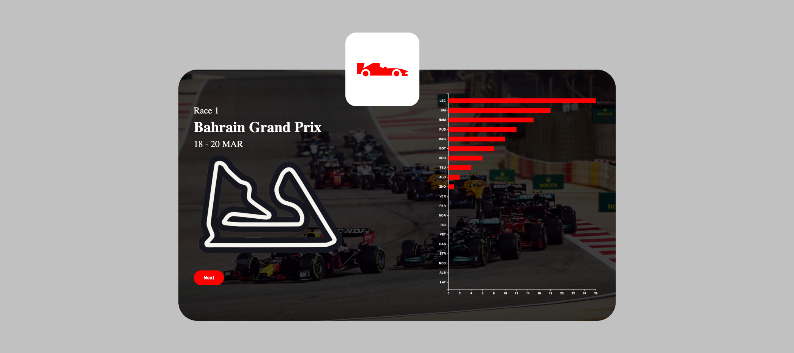

# Data visualisatie | Tech-track
# 

## 🏎 F1 2022 seizoensverloop
Mijn visualisatie laat het Formule 1 2022 seizoensverloop zien. De grafieksoort die ik hiervoor heb gebruikt is een horizontale barchart. De barchart laat per race de groei in kampioenschapspunten zien. Zo krijg je een goed beeld hoe het seizoen is verlopen.

*De applicatie is ontworpen voor een 13inch laptop scherm, en kan misschien op andere schermen niet correct weergegeven worden*

## ⚙️ Installeren
Clone de repository
```
git clone https://github.com/maxvl3/data-visualisatie.git
```

Installeer de packages
```
npm install
```

Start de applicatie
```
npm run dev
```

## 📂 Data
De applicatie maakt gebruikt van een zelfgemaakte google sheet. Deze is te bekijken via de volgende link: https://docs.google.com/spreadsheets/d/1jmeYXeE-VrP_qJgBJFZyrcz4e3OAIo9IkDAMAR4h2Ek/edit?usp=sharing

## 📄 Licentie
Er wordt gebruik gemaakt van de [MIT](https://github.com/maxvl3/data-visualisatie/blob/57a796185fbb6b0bf0a633bf0d6dd9b1e5b30420/LICENSE) licentie binnen dit project.

## ℹ️ Contact
Naam: Max van Liempdt<br>
Mail: max.van.liempdt@hva.nl<br>
Studentnummer: 500849046
